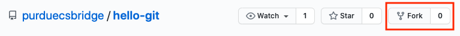
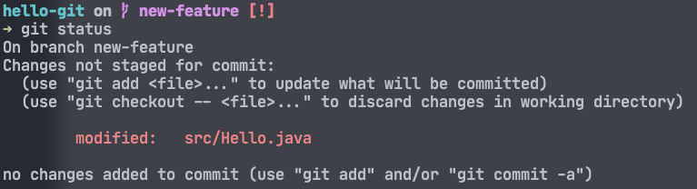
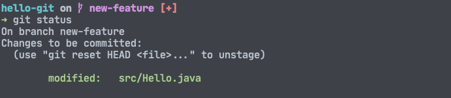
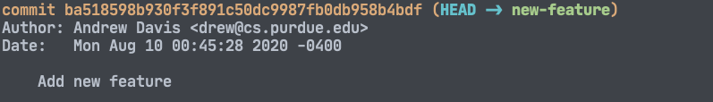
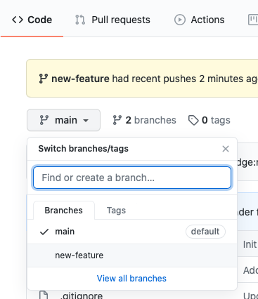

# Hello, Git!
Welcome to this Git tutorial! This document will help guide you on some Git basics.

## Background

### What is Git?
- Git is a piece of software known as a "version control system"
- It allows users to make changes to their code while also letting them go back to a previous version or see how their code has changed over time
- Git can be very difficult to master, but it is fairly easy to start using

### Executing Git commands
In order to follow this guide, you will need access to some command line that can execute Git commands. You can install Git by following the instructions on the [official Git website](https://git-scm.com/downloads).

## Getting Started

### What is a repository?
A **repository** is a grouping of files that Git tracks. When you add files to a repository, Git will keep track of any changes to those files between commits. A **commit** is a snapshot of the files in a repository at a certain time.

While a repository could hold any number of things, in practice, a repository should contain the source code, dependencies (or instructions on how to install them), and any additional resources needed for running the software project.

### Cloning
While Git can be used just to track files on one computer, Git's main purpose is to allow collaboration on a software project. A **central repository** is a repository that all collaborators have access to and is used as the reference copy for the project.

**Cloning** is the act of making a copy of a central repository on your local machine. You could clone this repository using the following Git command:

```shell
$ git clone https://github.com/purduecsbridge/hello-git
```

However, for this guide, we will do something a little bit different.

### Forking
When working with a central version control system, like [GitHub](https://github.com), you may want to make your own copy of another repository. **Forking** is the process of copying the current state of a repository to one that you control. This is especially useful if you want to make changes to a repository, but you don't have access to push new commits.

Let's start this guide by forking this repository to your GitHub account. If you do not have a GitHub account, create one [here](https://github.com/join). To fork this repository, click the **Fork** button at the top of the page:



GitHub will start the forking process and redirect you to your new repository when the process is finished. We can now clone your new repository by issuing the following Git command, replacing `$USER` with your GitHub username:

```shell
$ git clone https://github.com/$USER/hello-git
```

Alternatively, you can click the green **Code** button on GitHub to copy the URL to paste after `git clone`.

## Making changes
Navigate to your newly cloned repository using your terminal. If you list the contents of the folder, you can see the files that were present on GitHub.

### Branching
The insides of Git work like a tree. At the base, there contains at least one commit. However, you can create a new **branch** to keep any new changes separate from the original code. There is always at least one branch in a Git repository, usually referred to as the _main branch_.

It is usually best practice to create a new branch before making any new changes to the code. This makes it easy for you to go back to the original copy of the code, as well as make sure your code does not interfere with any of your fellow collaborators.

Let's create a new branch in this repository, and let's call it `new-feature`:

```shell
$ git checkout -b new-feature
```

This command tells Git to "checkout" a new branch called `new-feature`. We'll get further into _checking-out_ later.

### Staging
At this point, go ahead and make some changes to the `Hello.java` file inside of the `src` folder. You can open this repository in any editor or IDE, like IntelliJ IDEA.

After you've introduced your brand-new amazing feature, go back to the terminal. At any time, you can see the current state of your repository by running the `status` command for Git:

```shell
$ git status
```

Here is a sample output of the command:



You can see that Git gives us a lot of useful information. It tells us that we have changes made that have not been staged yet. **Staging** is the process of telling Git that you would like to make changes to the repository. Think of this like adding something to an online shopping cart, but not quite buying it yet.

You can stage all of the files listed by using this Git command:

```shell
$ git add -A
```

One thing to note is that if you make changes to any staged files, those changes will not be automatically staged. In this case, if you would like those new changes to be staged, you can run the same command again. You can also stage individual files:

```shell
$ git add src/Hello.java
```

You can run the `status` Git command again to see the updates:



### Committing
Once you are happy with your staged changes, the next step is to commit your changes. **Committing** tells Git that you are ready to create a new snapshot of the files in the repository. Git is smart and does not keep a copy of each file in every commit; instead, it keeps track of the changes made.

You can commit your staged files using this command:

```shell
$ git commit -m "Add new feature"
```

Let's break this command down. `git commit` is the commit command, which is pretty straightforward. The `-m` flag tells Git that we want to add a message in this command. Every commit must have a message, but adding this flag allows you to add the message here, rather than open an editor to add the message. After the message flag comes our message in double-quotes. It is best to keep commit messages short but informative. Here is a [guide](https://chris.beams.io/posts/git-commit/#seven-rules) that describes what good commit messages look like.

After running the command, Git will give a summary of what it just did. If you run `git status`, you will see that there are no changes. To see a history of the current branch, you can run the `log` Git command:

```shell
$ git log
```

Here is a sample of the `git log` output:



To exit the log, press the `Q` key.

### Pushing
Now that we've made a new commit on this branch, let's push our changes up to GitHub. **Pushing** is the process of integrating your changes into the central repository. This could simply be adding new commits to an existing branch or by adding a new branch with new commits.

In this case, GitHub has no idea about your new branch, since you created it on your local machine.

Let's push this new branch, along with the commit we made using this command:

```shell
$ git push -u origin new-feature
```

The `-u` flag here tells Git which central repository to associate with this branch. The two arguments right after tell Git the name of the _upstream_ and the name of the branch. Don't worry too much about the upstream; it will most likely always be `origin`.

You will only need to use the `-u` flag when you make a new branch that is not yet on GitHub. In the future, if you want to add more commits to an existing commit, you can simply use:

```shell
$ git push
```

After running the command, Git will ask for your GitHub username and password. Git will then upload your changes and provide some feedback during the process.

At this point, if you visit your GitHub repository, you may not notice any differences. In order to see your new commit, use the branch dropdown to switch branches:



Then you can see your new commit message at the top of the file browser. You can then check the `Hello.java` file in `src` to see your changes.

## Collaborating
For this section, we will focus on commands that you may find useful when collaborating with others or when working on multiple computers. For the purposes of this guide, this section is not meant to be followed along with, as these commands do not apply to the current state of the repository.

### Pulling
Let's say you are working with another person (or you are working on a project on multiple computers) on the same branch. In order to incorporate new changes into your local copy, you will need to pull them from GitHub. **Pulling** is the process of integrating changes that are not yet in your copy of the repository. This is accomplished by using the `pull` Git command:

```shell
$ git pull
```

You will have to authenticate with your GitHub credentials, just like pushing. Git will give you a summary as to what new changes have been made.

### Fetching
If you'd like to instead just see if any changes have been made, you can run the `fetch` command:

```shell
$ git fetch
```

This command will also update Git's list of branches on the central repository. `git fetch` is automatically called when running `git pull`, but it may be useful to run on its own in some cases.

### Checking Out
If you would like to switch branches, you use the `checkout` command.

```shell
$ git checkout main
```

This command checks out a branch named `main`. This may look familiar to creating a new branch. Git treats these two activities the same, with `-b` flag telling Git to create a new branch with the given name.

Be careful when switching branches with uncommitted changes, as Git may not be able to bring these changes along to the other branch if they conflict. The best way to resolve this, if it happens, is to first commit your changes, or to **stash** them. You can learn more about stashing [here](https://www.atlassian.com/git/tutorials/saving-changes/git-stash).

### Merging
When you run `git pull`, Git does the following things:

1. Run `git fetch`
2. Run `git merge` (by default)

**Merging** is taking the changes from one branch and incorporating them into the current one. In the case of pulling, Git just merges in the changes from the central repository branch into your local branch, but this can be used on different branches as well.

Merging is an important part of working in a team, especially when using multiple branches.

If you wanted to merge a branch named `new-feature` into the `main` branch on your local machine, you would first make sure you are on the `main` branch:

```shell
$ git checkout main
```

Then, you could merge the two branches:

```shell
$ git merge new-feature
```

The old branch, `new-feature`, still exists, but its changes are now incorporated into `main`. Git does this using a few different methods, depending on how far the branches have diverged. Git may create new commits, known as **merge commits**, that help integrate the two branches.

Sometimes, if the two branches have diverged too much, you may encounter a **merge conflict**. A merge conflict occurs when the same line(s) in a file have been changed in two different branches or commits. Since Git can not intelligently decide which version to use, you will have to manually intervene to decide how the code should look after the merge.

A good way to prevent merge conflicts is to pull often, especially if you are working in a team. However, sometimes a conflict cannot be avoided. In this case, a graphical Git client or an IDE can help resolve the conflicts.

### Pull/Merge Requests
A good way to merge changes from a branch into another is using **pull requests**. On GitHub, a pull request is a way of allowing others to see the changes from a branch and comment/approve them. GitHub will tell you if a merge will result in a conflict and will require you to resolve the conflict before merging.

You can open a pull request on GitHub by going to **Pull Requests** at the top of the repository and clicking the green **New pull request** button. GitHub will ask you to select the two branches to merge, and you can then add a title and description.

Other central version control systems may use terminology like **merge request**. This feature usually performs the same actions as pull requests on GitHub.

## Conclusion
This guide is not all-inclusive, but hopefully gives you a good understanding of the basics of using Git and GitHub. There are many other advanced Git commands that you can learn about on the [official Git website](https://git-scm.com/docs/git#_git_commands).
